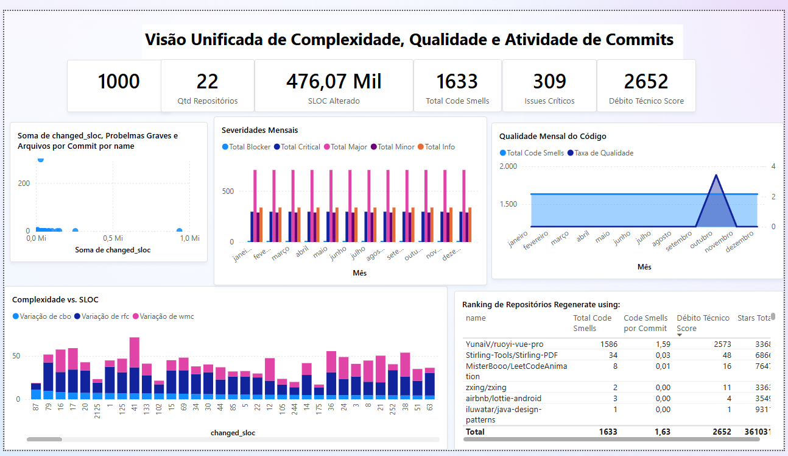

# LAB04 – Visualização de Dados BI TIS-6

## Introdução

Este trabalho integra as atividades do Laboratório de Experimentação em Engenharia de Software (TIS 6) e tem como propósito aplicar princípios de Business Intelligence (BI) na análise de informações provenientes de repositórios de software. Para isso, utiliza-se o Microsoft Power BI como principal ferramenta de exploração e visualização dos dados coletados.

O Business Intelligence consiste no conjunto de práticas voltadas à obtenção, organização, interpretação e apresentação de dados, permitindo que decisões sejam tomadas com base em informações concretas. Por meio de dashboards dinâmicos, torna-se possível observar padrões, identificar problemas recorrentes e reconhecer oportunidades de otimização, contribuindo para o aprimoramento da qualidade do código e para o aumento da eficiência das equipes de desenvolvimento.

## Caracterização do Dataset

O conjunto de dados analisado neste projeto foi obtido a partir de diversos repositórios hospedados no GitHub. Ele reúne informações referentes a commits, bem como métricas relacionadas à complexidade e à qualidade do código. As principais tabelas utilizadas e seus respectivos atributos estão apresentadas a seguir:

| Tabela | Descrição | Principais Campos |
|--------|-----------|------------------|
| `commits` | Registros de commits realizados | `commit_hash`, `created_at`, `repository_id`, `changed_files`, `changed_sloc` |
| `commits_metrics metrics` | Métricas de código por commit | `cbo`, `rfc`, `wmc`, `total_code_smells`, `blocker_quantity`, `critical_quantity`, `major_quantity`, `minor_quantity`, `info_quantity` |
| `commits_metrics repositories` | Dados dos repositórios | `name`, `stars`, `created_at` |

Período considerado na análise: **janeiro a dezembro** do ano avaliado  
Quantidade de repositórios analisados: **22**  
Número total de commits: **aprox. 1000**

As métricas foram estruturadas de forma a possibilitar comparações entre qualidade do código, níveis de complexidade e padrões de alteração, tanto por repositório quanto por recortes temporais.

## Dashboard Desenvolvido

O dashboard foi construído em **uma única página** contendo seis visualizações principais, permitindo uma análise integrada dos aspectos de atividade de desenvolvimento, severidade de problemas e complexidade estrutural.

A imagem abaixo apresenta o painel desenvolvido:



### Estrutura do Painel

1. **KPIs Gerais**  
   - Total de Repositórios  
   - Total de Commits  
   - Total de Code Smells  
   - Índice de Estabilidade  

2. **Evolução Mensal de Commits e SLOC Alterado**  
   Gráfico combinado mostrando a evolução da quantidade de commits e do volume de linhas de código alteradas ao longo dos meses.

3. **Distribuição de Severidades por Mês**  
   Barras empilhadas destacando a ocorrência mensal de Blockers, Criticals, Majors, Minors e Infos.

4. **Frequência de Commits vs Problemas Graves (RQ1)**  
   Dispersão relacionando total de commits e total de problemas graves por repositório.

5. **Tamanho Médio do Commit vs Complexidade (RQ2)**  
   Dispersão associando SLOC médio por commit e índice de complexidade (média de CBO, RFC e WMC).

6. **Complexidade Média por Faixa de Tamanho de Commit**  
   Gráfico de colunas agrupando commits em faixas de SLOC (0–20, 21–100, 101–500, 500+ LOC) e comparando a complexidade média.

## Questões de Pesquisa (RQs)

### RQ1: Como a frequência de commits influencia a estabilidade do código?

**Métricas envolvidas:**
- Total de Commits  
- Total de Blockers  
- Total de Criticals  
- Problemas Graves (Blocker + Critical)  
- Índice de Estabilidade = (Commits – Problemas Graves) / Commits

**Resultado encontrado:**  
Repositórios com maior número absoluto de commits tendem a apresentar mais problemas graves. Contudo, o índice de estabilidade mostra que a qualidade do processo influencia mais do que o volume de commits: alguns projetos mantêm alta estabilidade mesmo com elevada frequência de alterações.

### RQ2: O tamanho dos commits aumenta a complexidade estrutural do código?

**Métricas envolvidas:**
- SLOC Alterado  
- SLOC Médio por Commit  
- CBO Médio  
- RFC Médio  
- WMC Médio  
- Índice de Complexidade = (CBO + RFC + WMC) / 3  
- Complexidade por SLOC  

**Resultado encontrado:**  
Commits maiores apresentam tendência clara de introduzir maior complexidade estrutural. Faixas acima de 500 LOC concentram índices mais altos de complexidade, indicando que alterações extensas afetam negativamente a modularidade e a manutenibilidade do sistema.

## Metodologia

### Coleta e Processamento  
Os dados foram obtidos em formato CSV e também por extração de um banco MySQL contendo informações de commits, métricas e repositórios. Após a importação, foram realizadas normalização e limpeza das tabelas.

### Modelagem  
Foi criada uma tabela de calendário e definidos relacionamentos entre:  
- `Calendar[Date]` → `Commits[created_at]`  
- `Commits[commit_hash]` → `Metrics[commit_hash]`  
- `Repositories[repository_id]` → `Commits[repository_id]`

### Construção das Visualizações  
O painel utilizou gráficos de linha, barras empilhadas, dispersão e cartões KPI.  
As medidas foram elaboradas em DAX para agregação dinâmica das métricas principais.

## Principais Medidas (DAX)

### Atividade de Desenvolvimento
```DAX
Total Commits = COUNTROWS ( Commits )

SLOC Alterado = SUM ( Commits[changed_sloc] )

Arquivos Alterados = SUM ( Commits[changed_files] )

SLOC Médio por Commit =
DIVIDE ( [SLOC Alterado], [Total Commits], 0 )
